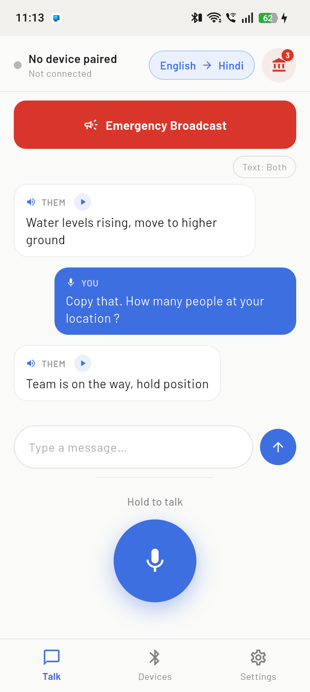
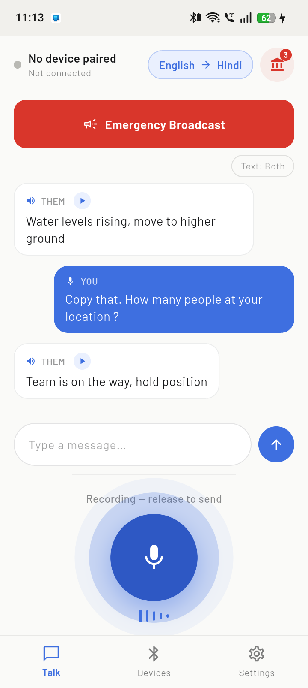
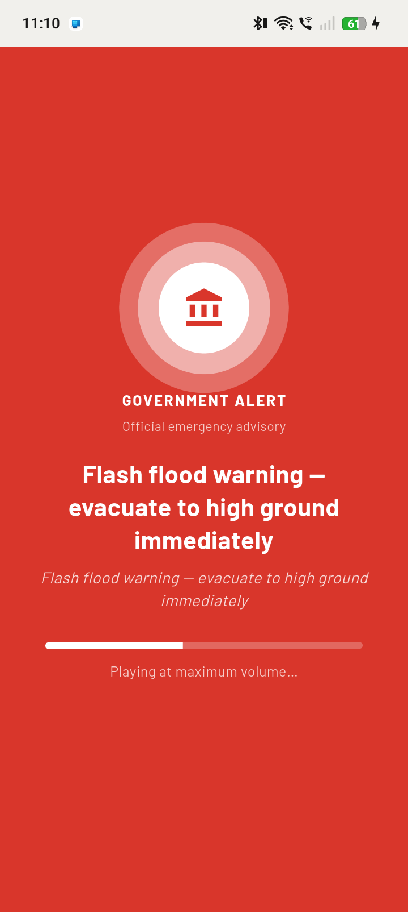
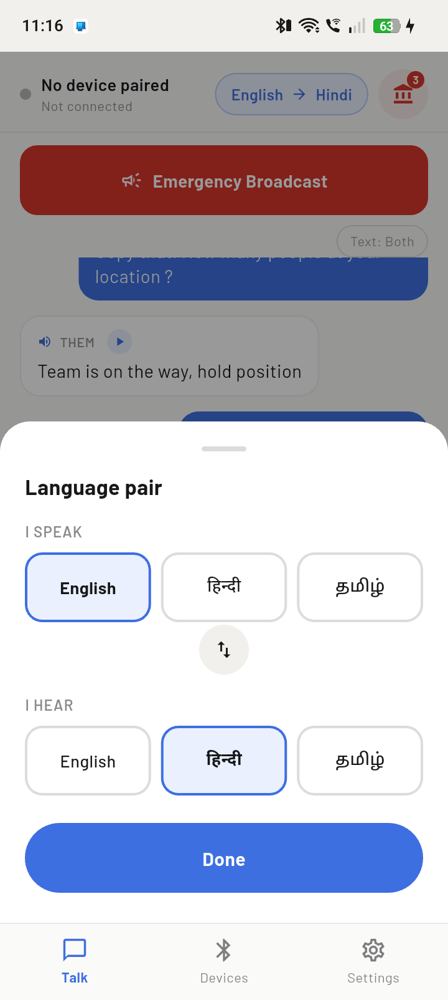
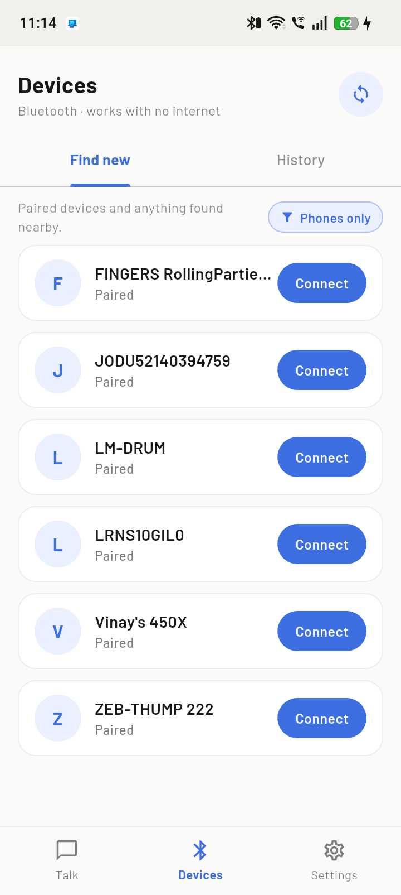
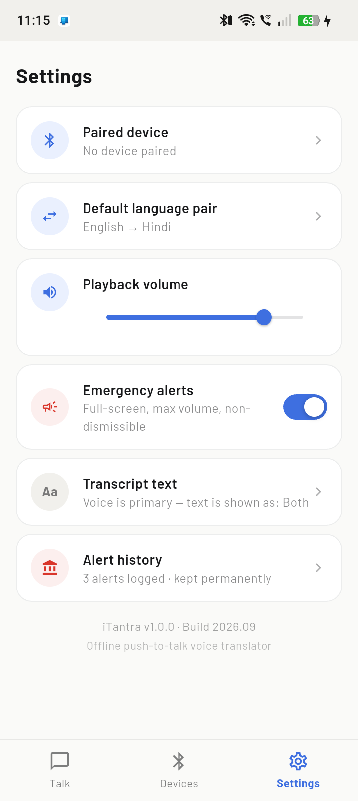
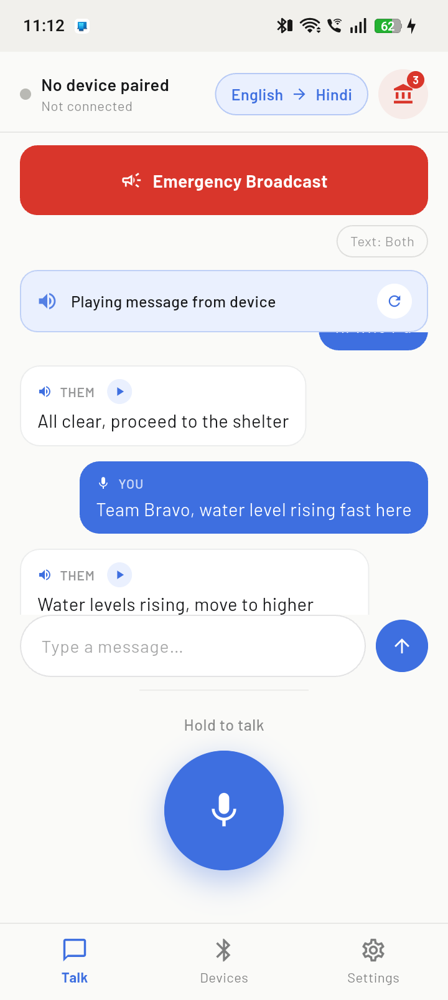
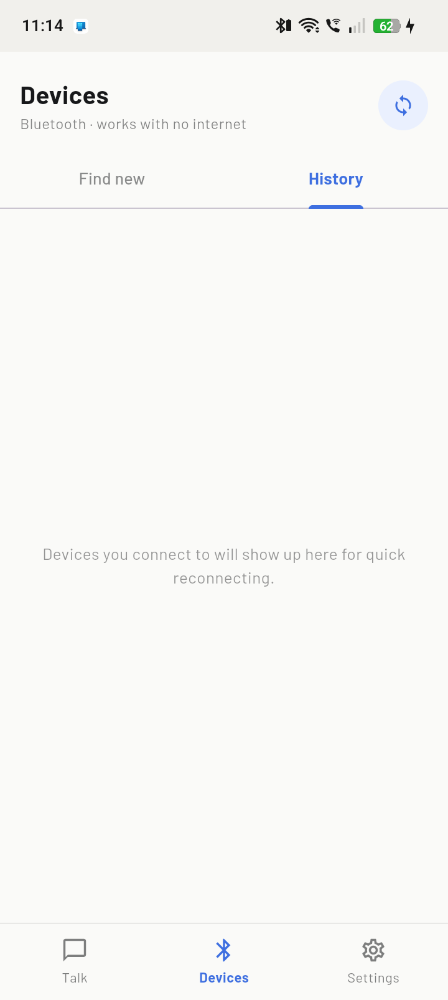

# iTantra

Offline, push-to-talk voice translator for Android — built for **SIH 2026, Problem Statement 26173** (ISRO / Department of Space).

Two phones communicate by voice over Bluetooth with no internet, no SIM, and no cell signal. Each side runs on-device speech-to-text and text-to-speech, so speech is transmitted as compact text and re-synthesized as speech at the receiver — a voice channel that works on links too narrow for any audio codec.

## Screenshots

| Conversation | Recording | Government alert |
|---|---|---|
|  |  |  |

| Language picker | Devices — Find new | Settings |
|---|---|---|
|  |  |  |

| Alert history | Playing a reply | Devices — History |
|---|---|---|
|  |  |  |

## Status

Real Bluetooth Classic connectivity is wired in (pairing, connecting, a background server so either phone can initiate). Voice itself — on-device STT and TTS — is still simulated: speaking or typing a message plays out a canned reply after a short delay, standing in for the real recognition/synthesis pipeline that hasn't been integrated yet.

## Features

**Home**
- Push-to-talk: hold the mic button to record, release to send
- Volume-up + volume-down held together works as a hardware PTT combo (native Android key interception) — while the app is open, physical volume buttons are dedicated to this instead of adjusting media volume
- A text input bar to type a message instead of speaking — feeds the same send/reply pipeline
- Live transcript with sent/received bubbles; tap the play icon on any received message to replay it individually, not just the latest one
- Language pair selector (English / Hindi / Tamil) and a script-mode toggle (native script / Latin transliteration / both)
- **Emergency Broadcast** — any user can send one; it's presented as an official **government alert** (full-screen takeover, non-dismissible, max volume), matching real disaster-broadcast conventions
- A badge icon for quick access to the alert log, without going through Settings

**Devices**
- **Find new** — paired and nearby-scanned Bluetooth devices, with a "Phones only" filter that hides common accessories (earbuds, speakers, wearables) by name — a heuristic, since the Bluetooth Classic plugin doesn't expose Android's real device-class field
- **History** — devices you've successfully connected to before, persisted locally, for one-tap reconnecting

**Settings**
- Paired device, default language pair, playback volume, emergency-alert toggle, transcript text mode
- **Alert history** — every broadcast sent or received is logged permanently to local storage (never auto-deleted)

## Tech stack

- **Flutter** (Dart), **provider** for state management
- **flutter_classic_bluetooth** — permissions, adapter state, discovery, pairing, RFCOMM connect/server
- **shared_preferences** — persisted connection history and alert log
- Native Android (`MainActivity.kt`) — volume-key combo interception via `dispatchKeyEvent`, forwarded to Flutter over a `MethodChannel`
- Bundled **Barlow**, **Noto Sans Devanagari**, **Noto Sans Tamil** fonts (no runtime font fetching, consistent with the fully-offline goal)

Not yet integrated:
- An offline STT engine (e.g. Vosk, or a quantized ONNX Conformer/Whisper model)
- An offline TTS engine (e.g. a quantized on-device neural voice, or `flutter_tts`)
- Sending recognized text and playing received text over the actual Bluetooth connection (the message pipeline is fully built — only the audio in/out ends are still simulated)

## Project structure

```
lib/
  main.dart                       # App entry, theme, root tab shell, volume-key PTT wiring
  app_state.dart                  # Message/reply/emergency state machine (simulated STT/TTS)
  models.dart                     # Message, LangCode, Phrase, EmergencyAlertRecord
  theme.dart                      # Color tokens and fonts
  services/
    bluetooth_manager.dart        # Real Bluetooth Classic connectivity + connection history
    volume_ptt_service.dart       # MethodChannel bridge for the volume-key PTT combo
  screens/
    home_screen.dart
    devices_screen.dart
    settings_screen.dart
    alert_history_screen.dart
  widgets/
    language_sheet.dart
    emergency_screen.dart
    wave_bars.dart
android/app/src/main/kotlin/.../MainActivity.kt   # Volume-key combo interception
assets/fonts/                     # Bundled offline font files
docs/screenshots/                 # Screenshots used in this README
```

## Running it

Requires the Flutter SDK and Android SDK set up (`flutter doctor` should be clean).

```bash
flutter pub get
flutter run
```

Or build an APK directly:

```bash
flutter build apk --debug     # larger, unoptimized, for testing
flutter build apk --release   # smaller, for sharing/installing
```

**Notes:**
- On some Android GPU drivers, Flutter's Impeller/Vulkan renderer can misbehave (solid black screen). This project disables Impeller in `android/app/src/main/AndroidManifest.xml` for broader device compatibility.
- Testing the two-phone Bluetooth link requires installing the app on two devices — one device's background server accepts the other's outgoing connection, so either side can initiate.
