# iTantra

Offline, push-to-talk voice translator for Android — built for **SIH 2026, Problem Statement 26173** (ISRO / Department of Space).

Two phones communicate by voice over Bluetooth with no internet, no SIM, and no cell signal. Each side runs on-device speech-to-text, machine translation, and text-to-speech, so speech is transmitted as compact text and re-synthesized as speech at the receiver — a voice channel that works on links too narrow for any audio codec, and that keeps working when every other form of connectivity has failed.

## Screenshots

| Talk home | Conversation | Broadcast — live translation |
|---|---|---|
| 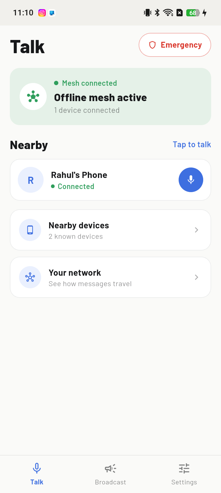 | 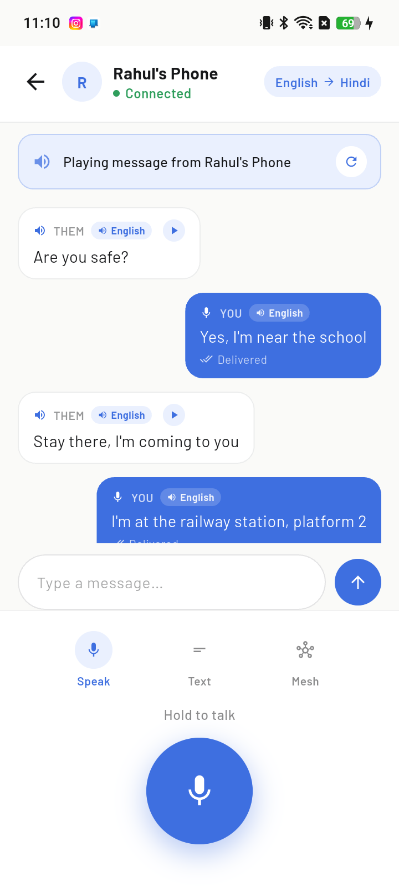 | 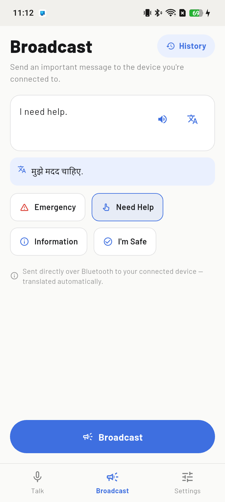 |

| Your network | Nearby devices | Devices — History |
|---|---|---|
|  | 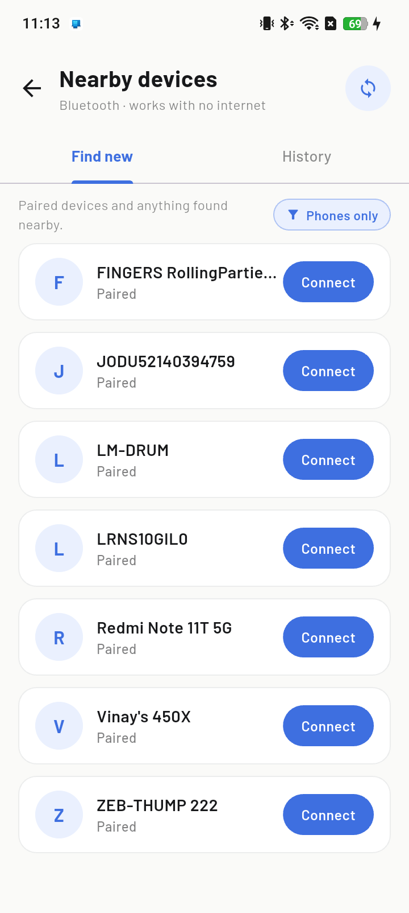 | 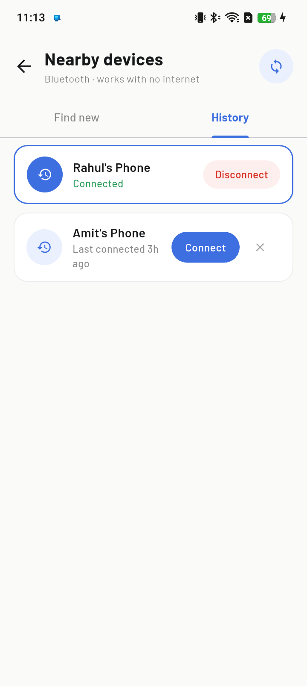 |

| Settings | Language pair | Alert history |
|---|---|---|
| 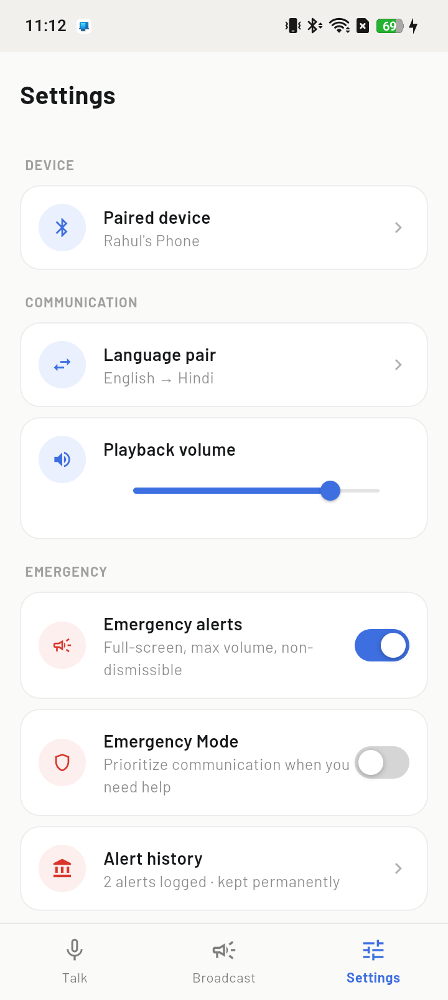 | 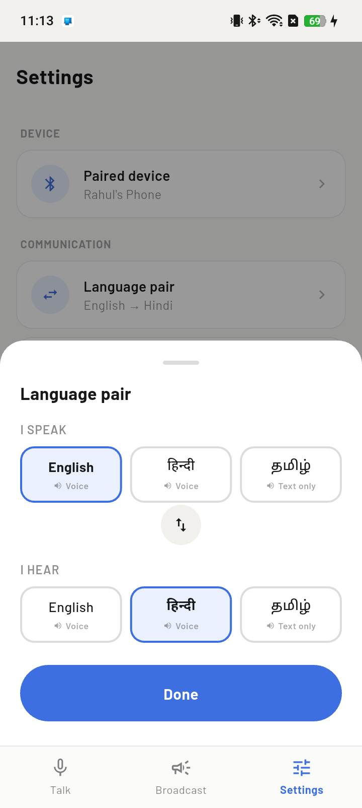 | 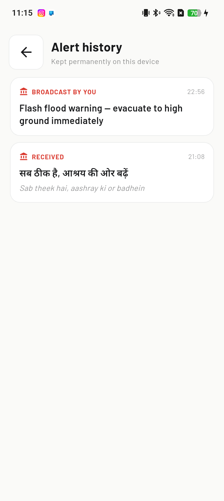 |

| Emergency alert |
|---|
| 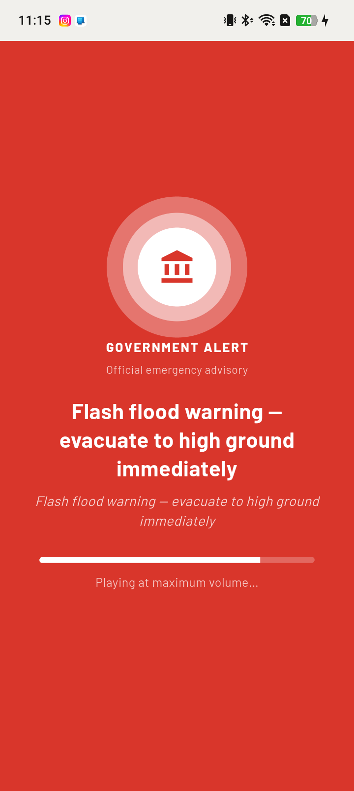 |

(Conversation and Broadcast show representative content so the layout and the real on-device translation output — "I need help." → "मुझे मदद चाहिए." — are visible; Broadcast's connected-device state needs a paired peer to reach, same as a live session would.)

## Status

The full offline voice pipeline is wired end to end and has been validated on real hardware, including a real two-phone Bluetooth pairing/connection:

1. **Push-to-talk** captures real speech on-device (no cloud, ever).
2. **Speech-to-text** (Vosk) transcribes it, with a live partial transcript shown while you're still speaking.
3. **Machine translation** (a quantized OPUS-MT/Marian ONNX model) translates it into the peer's language — with an on-screen preview so you can see the translation before sending, even without a connected peer.
4. The translated text — tagged with its actual language, so the receiver's TTS voice is always correct — is sent over the existing Bluetooth Classic connection as `MSG <id> <lang> <text>`, and acknowledged with `ACK <id>` so delivery status (Sending… / Delivered) is real, not simulated.
5. The receiving phone **speaks it** (on-device TTS) and shows it as a message bubble tagged with its language.

English and Hindi are fully supported (STT + MT + TTS); Tamil has TTS only — no bundled STT/MT model yet, so it's typed-text input only (flagged directly in the language picker, not a silent gap).

## User flow

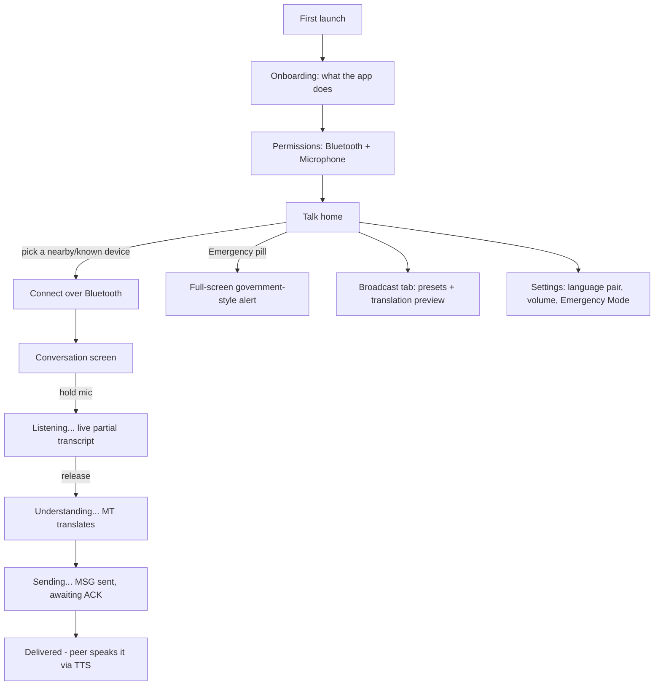
```mermaid
flowchart TD
    A[First launch] --> B[Onboarding: what the app does]
    B --> C[Permissions: Bluetooth + Microphone]
    C --> D[Talk home]
    D -->|pick a nearby/known device| E[Connect over Bluetooth]
    E --> F[Conversation screen]
    F -->|hold mic| G[Listening... live partial transcript]
    G -->|release| H[Understanding... MT translates]
    H --> I[Sending... MSG sent, awaiting ACK]
    I --> J[Delivered - peer speaks it via TTS]
    D -->|Emergency pill| K[Full-screen government-style alert]
    D --> L[Broadcast tab: presets + translation preview]
    D --> M[Settings: language pair, volume, Emergency Mode]
```

Day-to-day, a user: opens the app once through onboarding, pairs a phone from the **Talk** tab's "Nearby devices" link, then just holds the mic button to talk — everything from recognition to translation to delivery to the other phone speaking it happens automatically. Typing, broadcast presets, and the Emergency alert are all alternate paths into the same real pipeline, not separate simulated features.

## Features

**Onboarding**
- First-launch-only intro (what the app does) and a permissions screen that shows real Bluetooth/Microphone/Notification/Location status and requests them — gated so you can't continue without Bluetooth + Microphone, the two the app can't function without.

**Talk (home)**
- Mesh status card showing real connection state (not a fabricated device count).
- **Nearby** list of known/connected devices — tap a device's mic button to connect (if needed) and jump straight into a conversation.
- Links to **Nearby devices** (find/pair new ones) and **Your network** (an honest 2-node You↔peer view — no fabricated multi-hop mesh graph, since iTantra supports one direct connection at a time).
- A small **Emergency** pill that triggers the full-screen government-style alert from anywhere.

**Conversation**
- Push-to-talk: hold the mic button to record, release to send — or use the volume-up + volume-down hardware combo as a physical PTT button (native Android key interception; while the app is open, those keys are dedicated to this instead of media volume).
- **Live partial transcript** while you're still speaking, and a **Listening → Understanding → Sending** pipeline stepper that reflects the real STT/MT/Bluetooth state, not a fixed animation.
- Real delivery ticks (Sending… / Delivered) driven by an actual `MSG`/`ACK` round trip over Bluetooth.
- A **language badge** on every message bubble showing exactly which language (and therefore which TTS voice) it's in.
- A typed-message bar as an alternative to speaking, with a **speak-preview** button to hear your draft read back before sending.
- Tap the play icon on any received message to replay it individually, not just the latest one.

**Broadcast**
- Compose box with one-tap presets (Emergency / Need Help / Information / I'm Safe) that fill the text — never auto-send fabricated content.
- A **translate-preview** button shows the real translated text on screen, so you can check it before broadcasting, without needing a connected peer at all.
- A **speak-preview** button, same as Conversation.
- Sends through the same real recognize/translate/send pipeline as everything else; the "Emergency" preset triggers the full-screen alert instead of a normal message.

**Settings**
- Grouped into Device / Communication / Emergency / About.
- Language pair picker ("I speak" / "I hear") that shows **Voice** vs **Text only** per language — Tamil is marked honestly as text-only rather than silently failing to transcribe.
- Playback volume (actually controls TTS output volume, persisted).
- **Emergency Mode** — a real toggle: shows a persistent banner and turns off the decorative PTT pulse animation to genuinely cut background battery use, not just relabel the UI.
- **Alert history** — every broadcast sent or received is logged permanently to local storage (never auto-deleted).

**Devices**
- **Find new** — paired and nearby-scanned Bluetooth devices, with a "Phones only" filter that hides common accessories (earbuds, speakers, wearables) by name — a heuristic, since the Bluetooth Classic plugin doesn't expose Android's real device-class field.
- **History** — devices you've successfully connected to before, persisted locally, for one-tap reconnecting, with a real **Disconnect** action on the currently connected device.

## Architecture

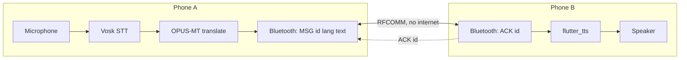
```mermaid
flowchart LR
    subgraph Phone A
        MicA[Microphone] --> STTA[Vosk STT]
        STTA --> MTA[OPUS-MT translate]
        MTA --> BTA[Bluetooth: MSG id lang text]
    end
    BTA <--> |RFCOMM, no internet| BTB[Bluetooth: ACK id]
    subgraph Phone B
        BTB --> TTSB[flutter_tts]
        TTSB --> SpeakerB[Speaker]
    end
    BTB -.ACK id.-> BTA
```

Inside each phone, the pipeline is coordinated by a single `AppState` (a `ChangeNotifier`) that owns three independent services and the Bluetooth connection:

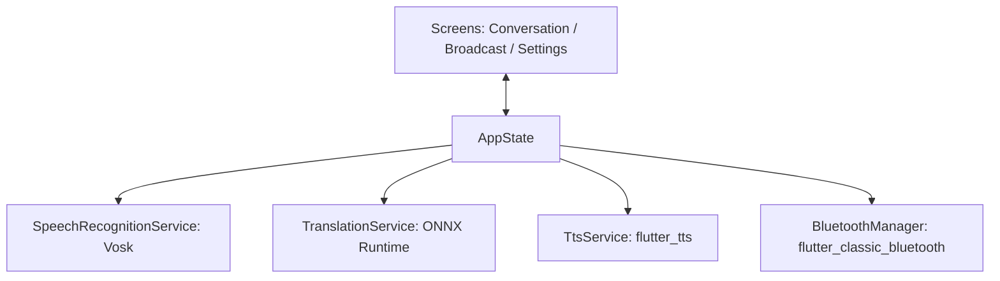
```mermaid
flowchart TD
    UI[Screens: Conversation / Broadcast / Settings] <--> AppState
    AppState --> STT[SpeechRecognitionService: Vosk]
    AppState --> MT[TranslationService: ONNX Runtime]
    AppState --> TTS[TtsService: flutter_tts]
    AppState --> BT[BluetoothManager: flutter_classic_bluetooth]
```

- **`AppState`** drives the recording → translate → send state machine (`PipelineStage`: idle/listening/understanding/sending), tracks per-message delivery status via a `Map<btMessageId, appMessageId>`, and is the only thing screens talk to — no screen calls a service directly.
- **`BluetoothManager`** owns exactly one active RFCOMM connection (either side can initiate; a background server always listens so an incoming connection is auto-accepted) and implements the wire protocol: `MSG <id> <langCode> <text>` / `ACK <id>`, newline-framed.
- Each service is independently swappable: `SpeechRecognitionService`, `TranslationService`, and `TtsService` expose a small async API and don't know about each other or about Bluetooth.

## Methodology

The core design constraint is **everything must work with zero connectivity** — no internet, no SIM, no cell signal — because that's precisely the condition this app targets (disaster response, remote areas). That constraint shaped every technical decision:

- **On-device models only.** Speech recognition (Vosk), translation (OPUS-MT via ONNX Runtime), and speech synthesis (the OS's own TTS engine) all run locally. Nothing is ever sent to a server.
- **Text over Bluetooth, not audio.** Translating to text and sending that (instead of streaming/compressing audio) means the link only needs to carry a few hundred bytes per utterance — viable even on constrained Bluetooth Classic throughput, and naturally gives a transcript for free.
- **Honesty over polish.** Earlier UI iterations of this app simulated STT/TTS with fixed timers and canned phrases. Every one of those was replaced with the real pipeline this session — and where a UI reference design implied capabilities the app doesn't have (true multi-hop mesh routing, fabricated device-reach counts), the shipped UI shows the real, single-connection state instead of faking it. The language picker tells you up front which languages have working voice input instead of silently failing.
- **Lightest viable models.** Vosk's small/mid-tier models and a quantized (int8) OPUS-MT ONNX export were chosen over much larger alternatives (full Vosk models run 1.5–2.3GB; un-quantized translation models are several times larger) to keep the app installable on modest devices and quick to update in the field — at a real accuracy cost that's documented, not hidden.

## Tech stack

- **Flutter** (Dart), **provider** for state management
- **flutter_classic_bluetooth** — permissions, adapter state, discovery, pairing, RFCOMM connect/server; `BluetoothManager` implements the `MSG`/`ACK` text protocol on top of it
- **vosk_flutter** — offline speech-to-text (English mid-tier "lgraph" model, Hindi small model), including its own on-Android microphone capture and live partial results
- **onnxruntime** + **dart_sentencepiece_tokenizer** — offline English↔Hindi translation: quantized (int8) ONNX exports of Helsinki-NLP's OPUS-MT (Marian) models, tokenized with the models' own `.spm` SentencePiece files, greedy-decoded on-device
- **flutter_tts** — offline text-to-speech via the OS's own TTS engine, per-message language selection
- **permission_handler** — microphone permission request/status (Bluetooth permissions come from `flutter_classic_bluetooth` itself)
- **shared_preferences** — persisted connection history, alert log, volume, Emergency Mode, onboarding-seen flag
- Native Android (`MainActivity.kt`) — volume-key combo interception via `dispatchKeyEvent`, forwarded to Flutter over a `MethodChannel`
- Bundled **Barlow**, **Noto Sans Devanagari**, **Noto Sans Tamil** fonts (no runtime font fetching, consistent with the fully-offline goal)

## Model assets

The STT and translation models (~300MB total) aren't committed to git — fetch them once with:

```bash
scripts/download_models.sh     # macOS/Linux/Git Bash
scripts/download_models.ps1    # Windows PowerShell
```

This downloads, into `assets/models/` (gitignored):
- `vosk-model-en-us-0.22-lgraph.zip` (~125MB, mid-tier — noticeably more accurate than Vosk's small tier) / `vosk-model-small-hi-0.22.zip` (~40MB — Hindi has no mid-tier option, only small-42MB or full-1.5GB) — Vosk STT models
- `mt-en-hi/` / `mt-hi-en/` — quantized ONNX OPUS-MT translation models plus their tokenizer files (~110MB each direction)

`flutter run`/`flutter build` will fail on missing assets until this has been run once. Tamil has no bundled STT/MT model, so typed text is the only input for that language pair for now.

## Project structure

```
lib/
  main.dart                            # App entry, onboarding gate, theme, root tab shell, volume-key PTT wiring
  app_state.dart                       # The real pipeline state machine: recording, STT, MT, Bluetooth send/ack, TTS playback
  models.dart                          # LangCode, Message, DeliveryStatus, EmergencyAlertRecord
  theme.dart                           # Color tokens and fonts
  services/
    bluetooth_manager.dart             # RFCOMM connection + MSG/ACK wire protocol + connection history
    speech_recognition_service.dart    # Vosk STT: model loading, start/stop listening, live partials
    translation_service.dart           # ONNX Runtime + SentencePiece: English<->Hindi translation
    tts_service.dart                   # flutter_tts wrapper: per-language voice, volume, completion callback
    volume_ptt_service.dart            # MethodChannel bridge for the volume-key PTT combo
  screens/
    onboarding_screen.dart             # First-launch intro + permissions
    home_screen.dart                   # Talk home: mesh status, nearby devices, links
    conversation_screen.dart           # The message thread, pipeline stepper, PTT button
    broadcast_screen.dart              # Compose + presets + translation preview
    network_screen.dart                # Honest 2-node "Your network" view
    devices_screen.dart                # Find new / History device lists
    settings_screen.dart
    alert_history_screen.dart
  widgets/
    language_sheet.dart                # Language pair picker with voice/text-only indicators
    emergency_screen.dart              # Full-screen government-style alert
    wave_bars.dart                     # Recording waveform animation
android/app/src/main/kotlin/.../MainActivity.kt   # Volume-key combo interception
android/app/proguard-rules.pro        # JNA (Vosk) keep rules + R8 dontwarn for desktop-only AWT refs
scripts/download_models.sh|.ps1       # Fetches the ~300MB of model assets
assets/fonts/                          # Bundled offline font files
docs/screenshots/                      # Screenshots used in this README
```

## Running it

Requires the Flutter SDK and Android SDK set up (`flutter doctor` should be clean), and the model assets downloaded once (see "Model assets" above).

```bash
flutter pub get
flutter run
```

Or build an APK directly:

```bash
flutter build apk --debug                      # larger, unoptimized, for testing
flutter build apk --release --split-per-abi    # ~359MB (arm64-v8a) vs ~588MB debug — see below
```

**Notes:**
- On some Android GPU drivers, Flutter's Impeller/Vulkan renderer can misbehave (solid black screen). This project disables Impeller in `android/app/src/main/AndroidManifest.xml` for broader device compatibility.
- Testing the two-phone Bluetooth link requires installing the app on two devices — one device's background server accepts the other's outgoing connection, so either side can initiate.
- `--release --split-per-abi` enables R8 minification/resource shrinking and produces one APK per ABI instead of a universal one, cutting installed size roughly 39% (the bundled ONNX/Vosk models dominate what's left and aren't ABI-specific, so they're the same size either way). Use the `arm64-v8a` build for any phone from the last ~8 years; `armeabi-v7a` covers older 32-bit devices; `x86_64` is for emulators only.
